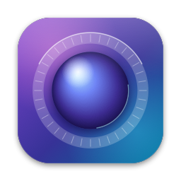
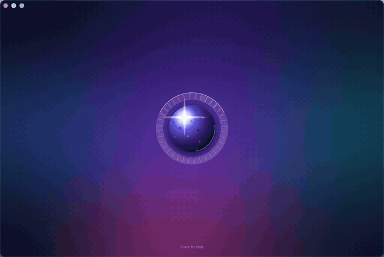
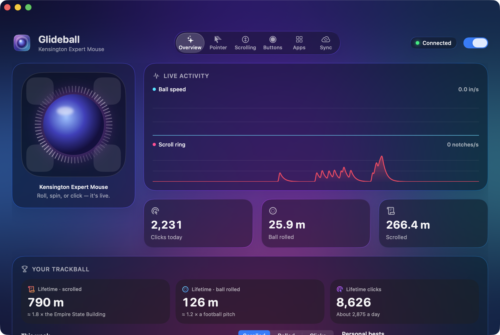
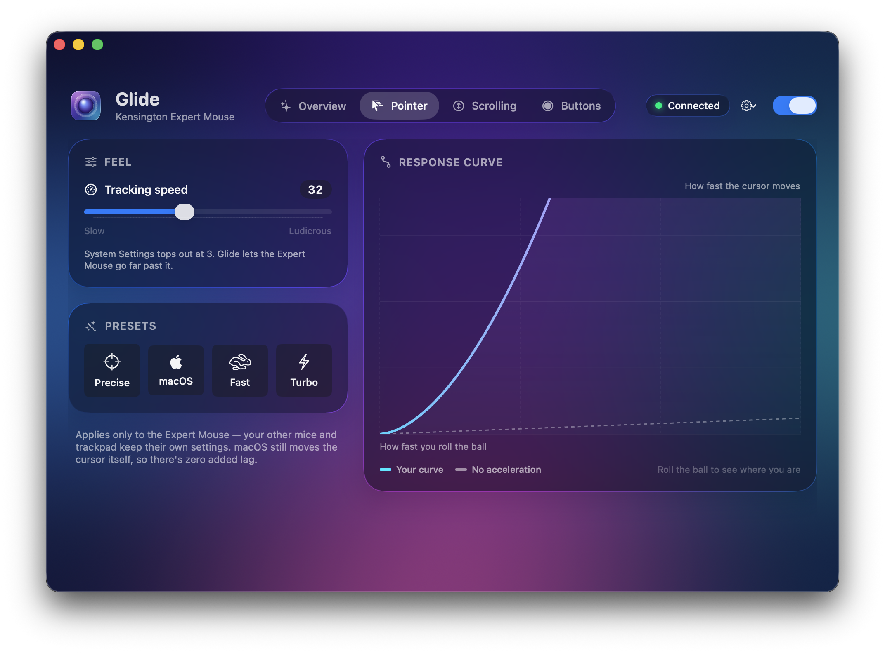
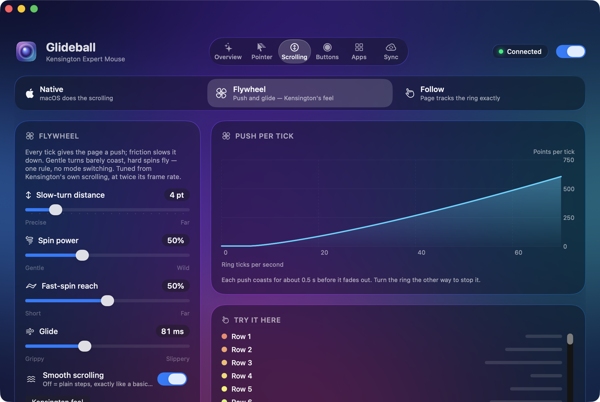
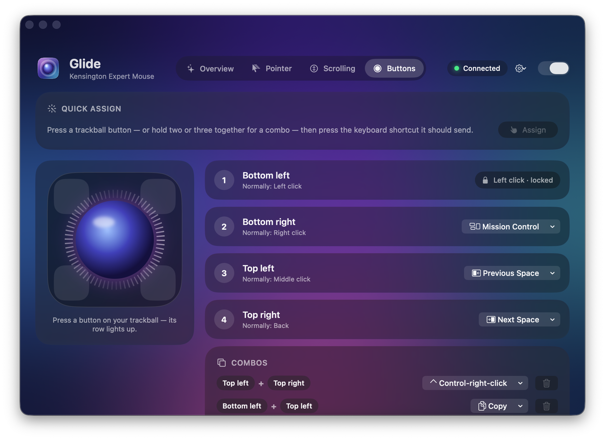

<p align="center">
  
</p>

<h1 align="center">Glideball</h1>
<p align="center"><i>Formerly called Glide.</i></p>

<p align="center">
  <b>A native macOS app that makes the Kensington Expert Mouse feel right: faster pointer, a better scroll ring, and programmable buttons.</b>
</p>

<p align="center">
  <a href="https://github.com/leviholliday/glideball/releases/latest/download/Glideball.zip"><b>Download Glideball.zip</b></a>
  &nbsp;·&nbsp;
  <a href="https://glideball.netlify.app">Website</a>
  &nbsp;·&nbsp;
  Requires macOS 26 Tahoe or later
  <br>
  <a href="#linux--windows-preview">Linux &amp; Windows: <b>Preview</b></a>
</p>

<p align="center">
  
</p>

<p align="center">
  
</p>

Glideball replaces KensingtonWorks with a small, fast app built for the Expert Mouse. You can push pointer speed past the limit in System Settings, choose how the scroll ring should feel, and turn the four buttons into clicks, shortcuts, or multi-button combos. Your trackpad and other mice keep their own settings.

## Features

### Pointer speed beyond macOS's limit

System Settings stops tracking speed at 3. Glideball's slider goes from 0.5 to 80, with presets for Precise, macOS, Fast and Turbo. The setting is written to the **Expert Mouse's own HID service**, so it doesn't change your trackpad or other mice. macOS still moves the cursor, so Glideball adds no lag. A response curve shows where your current ball speed sits on the curve.

### Three scroll modes

| Mode | What it does |
| --- | --- |
| **Native** | macOS scrolls the ring itself, the way Kensington's driver did. You can set the wheel speed for the Expert Mouse alone, up to 5 (System Settings stops at 1.7). |
| **Flywheel** *(default)* | Each tick pushes the page and friction slows it down. Gentle turns barely coast and hard spins fly, using one rule with no mode switching. The model comes from measurements of Kensington's own scrolling and runs in sync with your display. Sliders set slow-turn distance, spin power and glide (40–160 ms), and a one-click **Kensington feel** button restores the measured values. |
| **Follow** | The page tracks the ring exactly and stops when you stop. Spin acceleration is optional. **Throw to coast** lets a real flick glide and land using macOS's own deceleration curve, and turning the ring back catches it. |

In Flywheel and Follow, holding ⇧ scrolls sideways, ⌘/⌃/⌥ + scroll keep their usual meaning (zoom, for example), and you can flip the direction or turn smoothing off to get plain steps.

### Buttons, combos and shortcuts

- **Remap buttons:** each button can be set to left, right or middle click, back/forward, ⌃/⌘/⇧/⌥-click, Previous/Next Space, Mission Control, App Exposé, Spotlight, copy/paste/undo, tabs, any recorded keyboard shortcut, or nothing.
- **2- and 3-button combos:** hold buttons together to trigger a separate action. A button that belongs to a combo waits 70 ms for its partners. Buttons that aren't in any combo respond instantly.
- **Quick assign:** press a trackball button (or several together), then press the shortcut you want it to send.
- **Hold shortcuts:** the key stays down for as long as you hold the button, which suits push-to-talk dictation.
- **Primary click is locked for safety.** The bottom-left button always stays a left click, so a mapping can never lock you out.

### ⌃⌥⌘G panic pause

Press **⌃⌥⌘G** anywhere to pause or resume Glideball. It needs no permissions, so it works even if a mapping has left the trackball hard to use. The switch in the window header does the same thing.

Under **Overview › Keyboard shortcuts** you can change it, and add optional shortcuts that switch **Precision**, **Scroll with ball** (stays on until you press it again) and **Drag lock** on and off from any app.

### Live dashboard

The Overview tab shows an animated Expert Mouse whose buttons light up and whose ring spins as you use them. It also has live graphs of ball speed (in/s) and scroll-ring speed (notches/s), and today's clicks, distance rolled and distance scrolled. **Open at login** starts Glideball quietly in the background.

### Backup & Sync

- **Export** your settings as a `.glide-settings` file. You can save it, share it, or drag it straight out of the window.
- **Import** a file by double-clicking it, dropping it on the window, or using File › Import. Glideball shows a side-by-side preview of what will change before replacing anything, and you can undo the import.
- **Sync with iCloud Drive** keeps every Mac signed in to your Apple Account in step through the `iCloud Drive › Glide` folder. No extra account is needed. The pause switch stays separate on each Mac.
- **Automatic backups** save a snapshot of your settings once a day (only when something changed), plus one before every import or restore. Glideball keeps every backup from the last two weeks, then one per month for a year, and deletes anything older. Each backup is about 1 KB, so the whole history stays under 50 KB. The Sync tab shows them on a timeline with what each one would change, and restores one with a click (and Undo).

### Nine languages

Glideball speaks English, Español, Français, Deutsch, Italiano, Português (Brasil), 日本語, 한국어 and 简体中文. It follows your Mac's language, or pick one in Overview › General › Language. Translators: see [`scripts/l10n/README.md`](scripts/l10n/README.md).

<details>
<summary><b>More screenshots</b></summary>
<br>
<p align="center">
  
  
  
</p>
</details>

## Install

> [!IMPORTANT]
> **Uninstall KensingtonWorks first, then restart your Mac.** Kensington's driver handles the trackball itself and conflicts with Glideball.

Or with [Homebrew](https://brew.sh): `brew install --cask leviholliday/tap/glideball`

1. **Download** [Glideball.zip](https://github.com/leviholliday/glideball/releases/latest/download/Glideball.zip), unzip it, and drag **Glideball.app** into **Applications**.
2. **Open it once and approve it in Gatekeeper.** Glideball is signed with a local certificate, not a paid Apple Developer ID, and isn't notarized, so macOS blocks the first launch. Open Glideball and dismiss the warning. Then go to **System Settings › Privacy & Security**, scroll down to the message about Glideball, click **Open Anyway**, and confirm. You only need to do this once.
3. **Grant two permissions.** Glideball's window has buttons for both:
   - **Accessibility** lets Glideball rewrite button and scroll events.
   - **Input Monitoring** lets Glideball tell the Expert Mouse apart from your other devices and read the scroll ring.

   Until both are on, the trackball works normally and Glideball does nothing.

Closing the window keeps Glideball running. Click its Dock icon to bring the window back, or press ⌘Q to quit. When a new version is out, an **Update** button appears in the window header.

**To uninstall,** quit Glideball and move it to the Trash. To also remove its settings, run `defaults delete com.leviholliday.glide`.

## Linux & Windows (Preview)

> [!NOTE]
> **These are previews.** They share the Mac app's scroll physics, buttons, combos and `.glide-settings` file format, and their automated tests pass, but they've barely been tried on real hardware yet. Expect rough edges — and please [send feedback](https://glideball.netlify.app/feedback/).

| | Download | Details |
|---|---|---|
| **Linux** (Ubuntu 24.04+, Fedora 39+) | [Glideball-Linux-Preview.tar.gz](https://github.com/leviholliday/glideball/releases/latest/download/Glideball-Linux-Preview.tar.gz) · [.deb](https://github.com/leviholliday/glideball/releases/latest/download/Glideball-Linux-Preview.deb) | Unpack and run `./install.sh`. See [linux/README.md](linux/README.md). |
| **Windows** 10/11 | [Installer (x64)](https://github.com/leviholliday/glideball/releases/latest/download/Glideball-Windows-Preview-Setup-x64.exe) · [ARM](https://github.com/leviholliday/glideball/releases/latest/download/Glideball-Windows-Preview-Setup-arm64.exe) | Unsigned, so SmartScreen warns once (More info › Run anyway). See [windows/README.md](windows/README.md). |

Both only take over Kensington trackballs; every other mouse, touchpad and trackball is left alone. Settings exported on a Mac import on Linux and Windows, and the other way round.

## How it works

Glideball never takes the trackball away from macOS. The Expert Mouse stays an ordinary mouse, and Glideball adjusts it from the side.

- **Event tap on a dedicated thread.** The input engine runs on its own high-priority thread and run loop, so a busy UI can never stall the mouse. A session-level `CGEventTap` sees button and scroll events and changes only the ones that came from the Expert Mouse. Events that Glideball posts itself are tagged, so it never processes them twice. If macOS disables the tap, Glideball turns it back on, and a maintenance timer retries anything that a late permission grant made possible.
- **`IOHIDManager` listens without seizing.** Glideball opens every pointing device read-only (it never uses `kIOHIDOptionsTypeSeizeDevice`). That is how it knows which device produced the latest event (Kensington's vendor ID is `0x047D`), how it reads raw scroll-ring detents straight from the HID reports, and where the live graphs get their data.
- **Per-device `HIDMouseAcceleration`.** Glideball doesn't move the cursor itself. It sets the acceleration value on the Expert Mouse's own `IOHIDServiceClient`, so macOS keeps doing pointer acceleration inside the HID system while other devices stay untouched. Glideball applies the value again after sleep, after you replug the trackball, or when the driver restarts.
- **Display-synced scroll engine.** In Flywheel and Follow modes, ring ticks feed a scroll engine driven by a `CADisplayLink`. It computes each frame for the moment that frame reaches the screen. It posts plain continuous pixel-scroll events with no gesture phases, so apps don't add momentum of their own.

### Scroll research notes

Flywheel is modeled on measurements of Kensington's own driver:

- The driver emits scroll output at **60 Hz**. Between ticks, the speed decays by a factor of **0.816 per frame**. That is exponential friction with a time constant of **τ = −(1/60 s) / ln 0.816 ≈ 82 ms**.
- In Glideball, each tick adds a push of `d / τ` to the page speed, which works out to exactly `d` points of travel. The distance `d` grows with spin rate. In the measurements, a slow tick moved about 4 pt, and a 10-tick flick moved about 2,300 pt and coasted for roughly half a second. Glideball uses the same friction (the default Glideball setting is τ ≈ 82 ms) but renders at your display's refresh rate instead of 60 Hz.

Follow mode's throw uses the shape of macOS's own momentum curve, **v(t) = v₀ (1 − t/T)³**, where T = c · v₀^⅓ (macOS uses c ≈ 0.063). A throw therefore travels v₀ T / 4 and stops at a definite moment, without a long creeping tail.

To try changes without a trackball, run **`scripts/scroll-sim/run.sh`**. It compiles the real `SmoothScroller.swift` together with a test harness and feeds it synthetic tick patterns shaped like real Expert Mouse logs: single ticks, slow turns, flicks, catches and reversals, snapped to 8 ms USB polling. For every mode it reports distance, latency, settle time, stalled frames and how steady the speed is.

## Building from source

You need macOS 26 and a Swift 6.2 toolchain (Xcode 26 or its Command Line Tools). There is no Xcode project; Glideball is a plain Swift package.

```sh
git clone https://github.com/leviholliday/glideball.git
cd glide
./build.sh           # build, install to /Applications/Glideball.app, and launch
./build.sh --icon    # also re-render the app icon first
```

Other scripts:

- `scripts/scroll-sim/run.sh` runs the scroll simulator described above.
- `scripts/release.sh 1.1 "Release notes"` is for maintainers. It bumps the version, builds and signs `release/Glideball.zip`, commits, tags, pushes and publishes the GitHub release. Add `--dry-run` to stop after building the zip.

### Optional: a local signing identity

macOS ties Accessibility and Input Monitoring grants to an app's code signature. An ad-hoc signature changes on every build, so you would have to grant both permissions again after each `./build.sh`. To avoid that, `build.sh` and `release.sh` look for a code-signing identity named **`Glide Local Signing`**:

```sh
security find-identity -p codesigning | grep "Glide Local Signing"
```

If it's there, they sign with it. If not, they warn and fall back to ad-hoc signing. A self-signed certificate is enough, and you only need to create it once.

**With Keychain Access:**

1. Open **Keychain Access** and choose **Keychain Access › Certificate Assistant › Create a Certificate…**
2. Set **Name** to `Glide Local Signing`, **Identity Type** to *Self-Signed Root*, and **Certificate Type** to *Code Signing*. Click **Create**.
3. The first time `codesign` uses the key, macOS asks for access. Choose **Always Allow**.

<details>
<summary><b>Or from Terminal</b></summary>

```sh
cat > glide-signing.cnf <<'EOF'
[req]
distinguished_name = dn
x509_extensions = ext
prompt = no
[dn]
CN = Glide Local Signing
[ext]
basicConstraints = critical, CA:false
keyUsage = critical, digitalSignature
extendedKeyUsage = critical, codeSigning
EOF

# /usr/bin/openssl is LibreSSL, whose .p12 format the macOS keychain accepts.
# (With OpenSSL 3, add -legacy to the pkcs12 command.)
/usr/bin/openssl req -x509 -newkey rsa:2048 -nodes -days 3650 \
  -config glide-signing.cnf -keyout glide-signing.key -out glide-signing.crt
/usr/bin/openssl pkcs12 -export -name "Glide Local Signing" \
  -inkey glide-signing.key -in glide-signing.crt -passout pass:glide -out glide-signing.p12

security import glide-signing.p12 -k ~/Library/Keychains/login.keychain-db \
  -P glide -T /usr/bin/codesign
rm glide-signing.cnf glide-signing.key glide-signing.crt glide-signing.p12
```

</details>

`security find-identity` will list the certificate as `CSSMERR_TP_NOT_TRUSTED`. That is expected: `codesign` can sign with an untrusted self-signed certificate, and macOS keeps permissions valid across builds as long as the certificate stays the same. Keep the private key to yourself, because anything signed with it under Glideball's bundle identifier inherits Glideball's permissions.

## Shipping an update

```bash
scripts/ship.sh 2.1 "What's new in this version"
```

That builds a universal app, signs it, publishes the GitHub release, redeploys the website, and installs the new build locally. Everyone running Glideball sees an **Update** button within a day; one click downloads it, checks that it's signed with the same certificate (tampered downloads are refused), swaps the app, and relaunches — permissions carry over because the signature matches. `scripts/release.sh` does just the GitHub half and has a `--dry-run`.

## Privacy

- **No analytics, telemetry or tracking.**
- Glideball makes network requests only to check GitHub's public releases API for a newer version (at launch, then once a day), to sync through your own iCloud Drive if you turn that on, and to send feedback when you press Send — you see everything that's included first.
- Feedback (from the app's Help menu or the website's [/feedback](https://glideball.netlify.app/feedback/) page) goes to the developer via a small Netlify function; it's read on a password-protected admin page and announced with an ntfy notification.
- iCloud Drive sync is off until you turn it on. When it's on, your settings go to **your own** iCloud Drive. Glideball has no server.
- Activity totals and the scroll diagnostics log (`~/Library/Logs/Glide/scroll.log`) stay on your Mac.

## Disclaimer

Glideball is an independent project. It is not affiliated with, endorsed by, or sponsored by Kensington. Kensington, Expert Mouse and KensingtonWorks are trademarks of their respective owners, and every other trademark belongs to its owner.

## License

[MIT](LICENSE) © 2026 Levi Holliday
